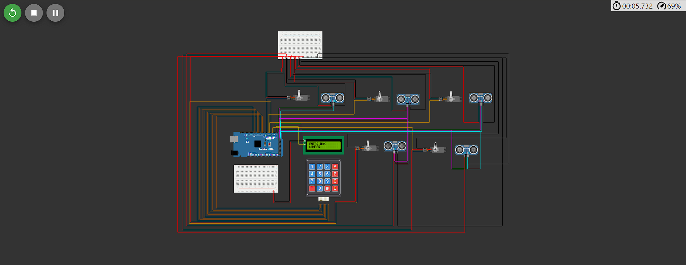
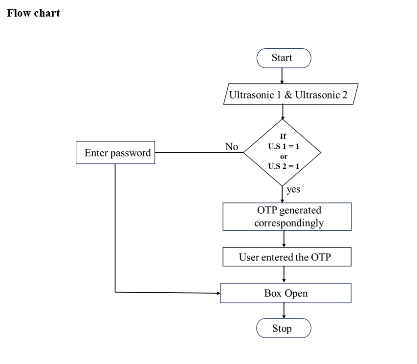

# ENHANCED GOODS DELIVERY MANAGEMENT
## 1.PROBLEM STATEMENT

- Secure and efficient storage is crucial in the goods delivery process, especially when customers are unavailable to receive orders.
- Issues like improper handling and delays often arise due to a lack of suitable storage solutions, leading to customer dissatisfaction.
- A centralized hub system with secure storage capabilities and real-time tracking can address these challenges.
- This solution ensures goods are safely stored until customers are ready to collect them.
- The system ultimately enhances overall delivery efficiency and customer satisfaction.

## 2. Solution Overview


### Hardware Infrastructure

- **Smart Delivery Hubs**
  - Set up a network of smart delivery hubs equipped with IoT devices and sensors.
  - Hubs to be strategically located in residential complexes, commercial areas, and public spaces.

- **Smart Lockers**
  - Install secure lockers with electronic locks and IoT-enabled control panels.
  - Lockers available in various sizes to accommodate different types of packages.

- **IoT Sensors**
  - Equip each locker with IoT sensors to monitor:
    - Security status
  - Use sensor data to ensure the safety and integrity of delivered goods.

- **Connectivity**
  - Establish a reliable internet connection for real-time communication between the central system and the IoT devices at each hub.


### 3. Virtual Circuit
### wokwi simulator
### [Link:https://wokwi.com/projects/406728672540522497](https://wokwi.com/projects/406728672540522497)



### 4. Model Image


## 5. Code
### Header
```c++

#include <Wire.h>
#include <Keypad.h>
#include <Servo.h>
#include <EEPROM.h>
#include <LiquidCrystal_I2C.h>
#include <SoftwareSerial.h> 
````
### globally initialized
```c++
LiquidCrystal_I2C lcd(0x27, 16, 2);
const byte numRows = 4;
const byte numCols = 4;
char keymap[numRows][numCols] = {
  {'1', '2', '3', 'A'},
  {'4', '5', '6', 'B'},
  {'7', '8', '9', 'C'},
  {'*', '0', '#', 'D'}
};
byte rowPins[numRows] = {2, 3, 4, 5};
byte colPins[numCols] = {6, 7, 8, 9};  
Keypad myKeypad = Keypad(makeKeymap(keymap), rowPins, colPins, numRows, numCols);
char option;
char presskey;
char keypressed;
char key;
char code[5] = {'5', '4', '3', '2', '1'};
char check1[sizeof(code)];
char check2[sizeof(code)];
short a = 0, i = 0, s = 0, j = 0;
```
### CLASS BOX
```c++
//<<<<< CLASS BOX>>>>>//
class Box{
   public:
   Servo myservo;
 private:
 int otp;
 int dub;
 String otpstring;
 int value;
 int trigPin1;
 int echoPin1;
 int  attach;
 int writevalue;
 char boxNo;
 int boxsize;
 
public:
  void setvalue(int trigPin1,int echoPin1, int  attach,int writevalue,int boxsize)
  {
    this->trigPin1=trigPin1;
    this->echoPin1=echoPin1;
    this->attach= attach;
    this->writevalue=writevalue;
    this->boxsize=boxsize; 
  }
  void setBoxNo(char boxNo)
  {
    this->boxNo=boxNo;
  }
  int attachfunction()
  {
    return attach;
  }
  int writevaluefunction()
  {
    return writevalue;
  }
  int trigPinfunction()
  {
    return trigPin1;
  }
  int echoPinfunction()
  {
    return echoPin1;
  }
  char boxNumber()
  {
    return boxNo;
  }
  int boxSize()
  {
    return boxsize;
  }
  float measureDistance(int trigPin, int echoPin) {
  digitalWrite(trigPin, LOW);
  delayMicroseconds(2);
  digitalWrite(trigPin, HIGH);
  delayMicroseconds(10);
  digitalWrite(trigPin, LOW);
  long duration = pulseIn(echoPin, HIGH);
  int distance_cm = duration * 0.034 / 2;
  return distance_cm;
}
void ReadCode() {               
  i = 0;                    
  a = 0;
  j = 0;
  while (keypressed != 'A') {                                   
    keypressed = myKeypad.getKey();
    if (keypressed != NO_KEY && keypressed != 'A' ) {     
      lcd.setCursor(j, 1);                                
      lcd.print("*");
      j++;
      if (keypressed == code[i] && i < sizeof(code)) {      
        a++;
        i++;
      }
      else
        a--;                                               
    }
  }
  keypressed = NO_KEY;
}

//<<<<<<<DELIVERY MAN OPEN>>>>>>>>//
void boxonedev()
   {
     lcd.clear();
    lcd.setCursor(0, 0);
    lcd.print("ENTER PASSWORD");            
    ReadCode();                        
    if (a == sizeof(code))  
    {    
      OpenDoor();   
      delay(1000);       
      }      
    else {
      lcd.clear();
      lcd.setCursor(1, 0);
      lcd.print("CODE"); 
      lcd.setCursor(6, 0);
      lcd.print("INCORRECT");
      delay(1000);
  lcd.clear(); 
   lcd.print("ENTER BOX");
   lcd.setCursor(0, 1);
   lcd.print("NUMBER");
     
    }
 }//<<<<<<DELIVERY MAN OPEN END>>>>>>//

//<<<<<<COUSTMER OPEN>>>>>//
 void boxonecos()
{
 lcd.clear();
    lcd.print("WELCOME");
    delay(500);
    keypressed = myKeypad.getKey();
     Serial.println(keypressed);
    otp = random(1000, 4999);
    otpstring = String(otp);
    //Serial.println(otpstring);//<<<opt generation>>>//
    lcd.clear();
    lcd.setCursor(0, 0);
    lcd.print("OTP SENT TO");
    lcd.setCursor(0, 1);
    lcd.print("YOUR MOBILE");
    delay(1000);
    Serial.print("OTP IS:");
    delay(1000);
    Serial.println(otpstring);
    delay(100);
   // SendSMS();
    lcd.clear();
    lcd.setCursor(0, 0);
    lcd.print("ENTER OTP:");
    getotp();
  
  }//<<<<<<COUSTMER OPEN END>>>>>//


//<<<<<<<<GET OTP FUNCTION>>>>>>>>
  void getotp() {
 
  String y = "";
  int a = y.length();
  while (a < 4) {
    char customKey = myKeypad.getKey();
    if (customKey) {
      lcd.setCursor(0, 1);
      y = y + customKey;
      lcd.print(y);
      a = y.length();
     

    }
  }
  Serial.print("ENTERED OTP IS:");
  Serial.println(y);
  if (otpstring == y) {
    lcd.setCursor(0, 0);
    lcd.print(" ACCESS GRANTED");
    lcd.setCursor(0, 1);
    lcd.print("DOOR OPEN");
   OpenDoor(); 
  } else {
    lcd.setCursor(0, 0);
    lcd.print("ACCESS FAILED");
    lcd.setCursor(0, 1);
    lcd.print("TRY AGAIN");
    delay(500);
  lcd.clear(); 
   lcd.print("ENTER BOX");
   lcd.setCursor(0, 1);
   lcd.print("NUMBER");
  }
}
void OpenDoor() {          
  lcd.clear();
  delay(1000);
  lcd.setCursor(1, 0);
  lcd.print("ACCESS GRANTED");
  lcd.setCursor(4, 1);
  lcd.print("OPEN...");
  myservo.write(90);
  delay(7000);
  myservo.write(0);
  delay(500);
  lcd.clear(); 
   lcd.print("ENTER BOX");
   lcd.setCursor(0, 1);
   lcd.print("NUMBER");
}
};
```
### OBJECT INITIALIZATION
```c++
//<<<<<<<<<OBJECTS>>>>>>>>
 Box b1;
 Box b2;
 Box b3;
 Box b4;
 Box b5;
 ```
 ### SETUP()
 ```c++
void setup()
{
  
//DEFAULT BOX SIZE 401CM FOR UNDERSTANDING
 //<<<<<<BOX 1>>>>>>//
  b1.setBoxNo('1');
  b1.setvalue(22,23,14,0,401);
  //setvalue(int trigPin1,int echoPin1, int  attach,int writevalue,int boxsize)
  b1.myservo.attach(b1.attachfunction());
  b1.myservo.write(b1.writevaluefunction());
  pinMode(b1.trigPinfunction(), OUTPUT);
  pinMode(b1.echoPinfunction(), INPUT);
  // <<<<<<>>>>>>//
  //<<<<<<BOX 2>>>>>>//
  b2.setBoxNo('2');
  b2.setvalue(24,25,15,0,401);
  //setvalue(int trigPin1,int echoPin1, int  attach,int writevalue,int boxsize)
  b2.myservo.attach(b2.attachfunction());
  b2.myservo.write(b2.writevaluefunction());
  pinMode(b2.trigPinfunction(), OUTPUT);
  pinMode(b2.echoPinfunction(), INPUT);
  // <<<<<<>>>>>>//
  //<<<<<<BOX 3>>>>>>//
  b3.setBoxNo('3');
  b3.setvalue(26,27,16,0,401);
  //setvalue(int trigPin1,int echoPin1, int  attach,int writevalue,int boxsize)
  b3.myservo.attach(b3.attachfunction());
  b3.myservo.write(b3.writevaluefunction());
  pinMode(b3.trigPinfunction(), OUTPUT);
  pinMode(b3.echoPinfunction(), INPUT);
  // <<<<<<>>>>>>//
  //<<<<<<BOX 4>>>>>>//
  b4.setBoxNo('4');
  b4.setvalue(28,29,17,0,401);
  //setvalue(int trigPin1,int echoPin1, int  attach,int writevalue,int boxsize)
  b4.myservo.attach(b4.attachfunction());
  b4.myservo.write(b4.writevaluefunction());
  pinMode(b4.trigPinfunction(), OUTPUT);
  pinMode(b4.echoPinfunction(), INPUT);
  // <<<<<<>>>>>>//
   //<<<<<<BOX 5>>>>>>//
  b5.setBoxNo('5');
  b5.setvalue(30,31,18,0,401);
  //setvalue(int trigPin1,int echoPin1, int  attach,int writevalue,int boxsize)
  b5.myservo.attach(b5.attachfunction());
  b5.myservo.write(b5.writevaluefunction());
  pinMode(b5.trigPinfunction(), OUTPUT);
  pinMode(b5.echoPinfunction(), INPUT);
  // <<<<<<>>>>>>//
   lcd.begin(16, 2);
  lcd.backlight();
  Serial.begin(9600);
   lcd.print("WELCOME TO");
   lcd.setCursor(0, 1);
   lcd.print("HUB STORE");
   delay(3000);
   lcd.clear();
   lcd.print("ENTER BOX");
   lcd.setCursor(0, 1);
   lcd.print("NUMBER");
}
```
### VOID LOOP()
```c++
//<<<<<<LOOP START>>>>>>>//
void loop()
{
 

    int distance = b1.measureDistance(b1.trigPinfunction(),b1.echoPinfunction());
    int distance2 = b2.measureDistance(b2.trigPinfunction(),b2.echoPinfunction());
    int distance3=  b3.measureDistance(b3.trigPinfunction(),b3.echoPinfunction());
    int distance4=b4.measureDistance(b4.trigPinfunction(),b4.echoPinfunction());
    int distance5=b5.measureDistance(b5.trigPinfunction(),b5.echoPinfunction());
    int box1size=b1.boxSize();
    int box2size=b2.boxSize();
    int box3size=b3.boxSize();
    int box4size=b4.boxSize();
    int box5size=b5.boxSize();
  static char userinput[11];
   static int count = 0;
   char number;
  option=myKeypad.getKey(); 
   //<<<<<<<<<<<BOX 1>>>>>>>>>>>>>
   if (option) {
   Serial.print("BOX: ");
   Serial.print(option);
   Serial.print(" ACCESS");
   Serial.println();
   
   }
   //<<<<<<<<BOX 1>>>>>>>>>//
 if((option==b1.boxNumber())&&((distance>=7)&&(distance<box1size)))
 {
  lcd.clear();
  lcd.setCursor(0, 0);
  lcd.print("YOU PRESSED");
  lcd.setCursor(0, 1);
  lcd.print("BOX:"+(b1.boxNumber()));
  lcd.setCursor(1 , 1);
  Serial.begin(9600);
  lcd.clear();
  b1.boxonedev();
  }
  else if((option==b1.boxNumber())&&(( distance<=7)||(distance>1000)))
  {
  
    Serial.println("YOU ENTER BOX:"+(b1.boxNumber()));
    b1.boxonecos(); 
     
 } 
 //<<<<<<<<<BOX 2>>>>>>>>>>
 else if((option==b2.boxNumber())&&((distance2>=7)&&(distance2<box2size)))
 {
  lcd.clear();
  lcd.setCursor(0, 0);
  lcd.print("YOU PRESSED");
  lcd.setCursor(0, 1);
  lcd.print("BOX:"+(b2.boxNumber()));
  lcd.setCursor(1 , 1);
  Serial.begin(9600);
  lcd.clear();
  b2.boxonedev();
  }
  else if((option==b2.boxNumber())&&(( distance2<=7)||(distance2>1000)))
  {
     Serial.println("YOU ENTER BOX:"+(b2.boxNumber()));
     delay(500);
     b2.boxonecos(); 
     
 } 
 //<<<<<<<<<BOX 3>>>>>>>>>>
 else if((option==b3.boxNumber())&&((distance3>=7)&&(distance3<box3size)))
 {
  lcd.clear();
  lcd.setCursor(0, 0);
  lcd.print("YOU PRESSED");
  lcd.setCursor(0, 1);
  lcd.print("BOX:"+(b3.boxNumber()));
  lcd.setCursor(1 , 1);
  Serial.begin(9600);
  lcd.clear();
  b3.boxonedev();
  }
  else if((option==b3.boxNumber())&&(( distance3<=7)||(distance3>1000)))
  {
     Serial.println("YOU ENTER BOX:"+(b2.boxNumber()));
     delay(500);
     b3.boxonecos(); 
     
 } 
 //<<<<<<<<<BOX 4>>>>>>>>>>
 else if((option==b4.boxNumber())&&((distance4>=7)&&(distance4<box4size)))
 {
  lcd.clear();
  lcd.setCursor(0, 0);
  lcd.print("YOU PRESSED");
  lcd.setCursor(0, 1);
  lcd.print("BOX:"+(b4.boxNumber()));
  lcd.setCursor(1 , 1);
  Serial.begin(9600);
  lcd.clear();
  b4.boxonedev();
  }
  else if((option==b4.boxNumber())&&(( distance4<=7)||(distance4>1000)))
  {
     Serial.println("YOU ENTER BOX:"+(b4.boxNumber()));
     delay(500);
     b4.boxonecos(); 
     
 } 
 //<<<<<<<<<BOX 5>>>>>>>>>>
 else if((option==b5.boxNumber())&&((distance5>=7)&&(distance5<box5size)))
 {
  lcd.clear();
  lcd.setCursor(0, 0);
  lcd.print("YOU PRESSED");
  lcd.setCursor(0, 1);
  lcd.print("BOX:"+(b5.boxNumber()));
  lcd.setCursor(1 , 1);
  Serial.begin(9600);
  lcd.clear();
  b5.boxonedev();
  }
  else if((option==b5.boxNumber())&&(( distance5<=7)||(distance5>1000)))
  {
     Serial.println("YOU ENTER BOX:"+(b5.boxNumber()));
     delay(500);
     b5.boxonecos(); 
     
 } 

}
//<<<<<LOOP END>>>>>>//
```

### 6. Block Diagram


### 7. Flowchart
 


